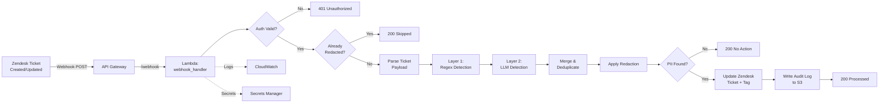

# PII / Compliance Redaction Gateway for Zendesk

Automated middleware that sanitizes all incoming Zendesk ticket payloads for sensitive data (Credit Cards, SSNs, Passwords, PHI) before they hit the Zendesk database or downstream analytics warehouses.

## Architecture



## Features

- **Two-Layer PII Detection**: Fast regex patterns (Layer 1) + contextual LLM analysis (Layer 2)
- **Multi-LLM Support**: Claude (primary), OpenAI, and Gemini with automatic fallback
- **8 PII Categories**: SSN, Credit Card (Luhn-validated), Email, Phone, Password/Credentials, PHI/Medical, Address, Names
- **Recursive Loop Prevention**: Tickets tagged `pii-redacted` are automatically skipped
- **Audit Trail**: JSON logs to S3, partitioned by date, with lifecycle policies — no PII stored
- **AWS Serverless**: Lambda + API Gateway + S3 + Secrets Manager + CloudWatch
- **Infrastructure as Code**: Full Terraform configuration with modular `.tf` files
- **Configurable**: Redaction style (bracket/mask), PII types, LLM provider, all via environment variables

## Supported PII Types

| Type | Detection Method | Examples |
|------|-----------------|----------|
| **SSN** | Regex + validation | `123-45-6789`, `SSN: 123456789` |
| **Credit Card** | Regex + Luhn check | Visa, Mastercard, Amex, Discover |
| **Email** | Regex | `user@example.com` |
| **Phone** | Regex + validation | `(555) 123-4567`, `+1-555-123-4567` |
| **Password** | Keyword proximity | `password: secret123`, `api_key=sk-xxx` |
| **PHI** | Regex + LLM | MRN numbers, DOB, ICD-10 codes, medications |
| **Address** | Regex + LLM | `123 Main Street`, ZIP codes in context |
| **Name** | LLM | `Patient John Smith`, contextual name detection |

## Quick Start

```bash
# 1. Clone the repository
git clone https://github.com/mohdasim/PII-Redaction-Gateway-for-Zendesk.git
cd PII-Redaction-Gateway-for-Zendesk

# 2. Install dependencies
pip install -r requirements-dev.txt

# 3. Run tests
pytest tests/ -v

# 4. Deploy (see SETUP.md for detailed instructions)
cp terraform/terraform.tfvars.example terraform/terraform.tfvars
# Edit terraform.tfvars with your settings
cd terraform && terraform init && terraform plan
```

## Configuration

All configuration is via environment variables (or `.env` file for local development).

| Variable | Default | Description |
|----------|---------|-------------|
| `LLM_PROVIDER` | `claude` | Primary LLM: `claude`, `openai`, or `gemini` |
| `LLM_ENABLED` | `true` | Set `false` for regex-only mode (cheaper/faster) |
| `ANTHROPIC_API_KEY` | — | Anthropic API key (required if using Claude) |
| `OPENAI_API_KEY` | — | OpenAI API key (fallback) |
| `GEMINI_API_KEY` | — | Google Gemini API key (fallback) |
| `LLM_CONFIDENCE_THRESHOLD` | `0.7` | Minimum confidence for LLM-only detections |
| `ZENDESK_SUBDOMAIN` | — | Your Zendesk subdomain |
| `ZENDESK_EMAIL` | — | Zendesk agent email for API auth |
| `ZENDESK_API_TOKEN` | — | Zendesk API token |
| `WEBHOOK_SECRET` | — | Shared secret for webhook authentication |
| `REDACTION_STYLE` | `bracket` | `bracket` → `[REDACTED-SSN]`, `mask` → `****` |
| `ENABLED_PII_TYPES` | all | Comma-separated PII types to detect |
| `AUDIT_S3_BUCKET` | — | S3 bucket for audit logs (set by Terraform) |
| `LOG_LEVEL` | `INFO` | Logging level |

## API Reference

### POST /webhook

Receives Zendesk webhook payloads and processes them for PII.

**Headers:**
- `X-API-Key: <webhook-secret>` — API key authentication
- `X-Zendesk-Webhook-Signature: <hmac>` — HMAC-SHA256 signature (alternative)

**Request Body:** Zendesk webhook payload (JSON)

**Response:**
```json
{
  "status": "processed",
  "ticket_id": 12345,
  "total_redactions": 3,
  "processing_time_ms": 1250.5
}
```

### GET /health

Health check endpoint.

**Response:**
```json
{
  "status": "healthy",
  "service": "pii-redaction-gateway",
  "version": "1.0.0"
}
```

## Project Structure

```
├── terraform/              # Infrastructure as Code
│   ├── main.tf             # Provider config
│   ├── variables.tf        # Input variables
│   ├── lambda.tf           # Lambda + IAM
│   ├── api_gateway.tf      # API Gateway
│   ├── s3.tf               # Audit bucket + lifecycle
│   ├── secrets.tf          # Secrets Manager
│   ├── cloudwatch.tf       # Dashboard + alarms
│   └── outputs.tf          # Output values
├── src/
│   ├── handlers/           # Lambda entry points
│   ├── services/           # Business logic
│   ├── models/             # Data models
│   └── utils/              # Config, logging, auth
├── tests/
│   ├── unit/               # Unit tests
│   ├── integration/        # End-to-end tests
│   └── fixtures/           # Sample payloads
├── scripts/deploy.sh       # Deployment script
└── docs/flowchart.md       # Detailed flowcharts
```

## Testing

```bash
# Install dev dependencies
pip install -r requirements-dev.txt

# Run all tests
pytest tests/ -v

# Run with coverage
pytest tests/ -v --cov=src --cov-report=html

# Run only unit tests
pytest tests/unit/ -v

# Run only integration tests
pytest tests/integration/ -v
```

## Security Considerations

- **No PII in logs**: Structured logger has a sanitization safety net that strips PII patterns
- **No PII in audit trail**: Only metadata (type, field, confidence) is stored — never the actual PII
- **Encrypted at rest**: S3 audit bucket uses AES-256 server-side encryption
- **Encrypted in transit**: S3 bucket policy denies unencrypted transport
- **Secret management**: All API keys stored in AWS Secrets Manager, not environment variables
- **HMAC authentication**: Webhook requests verified via HMAC-SHA256 signatures
- **Least privilege IAM**: Lambda role has minimal permissions (S3 put, Secrets read, CloudWatch logs)

## License

MIT License — see [LICENSE](LICENSE) for details.
