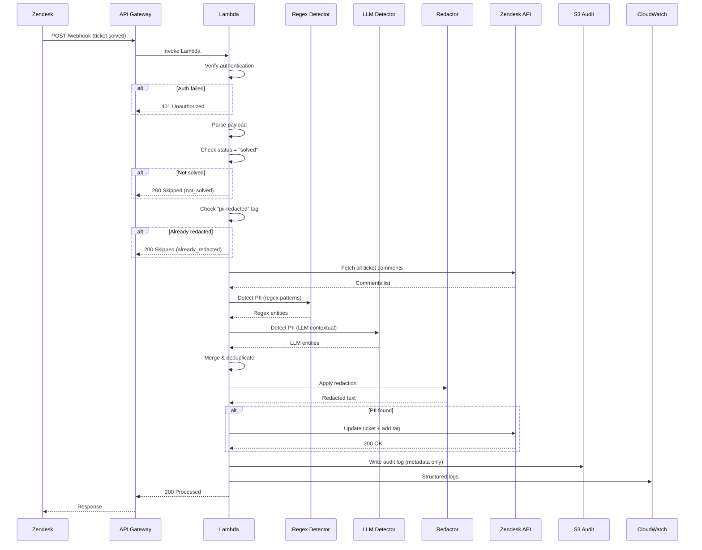
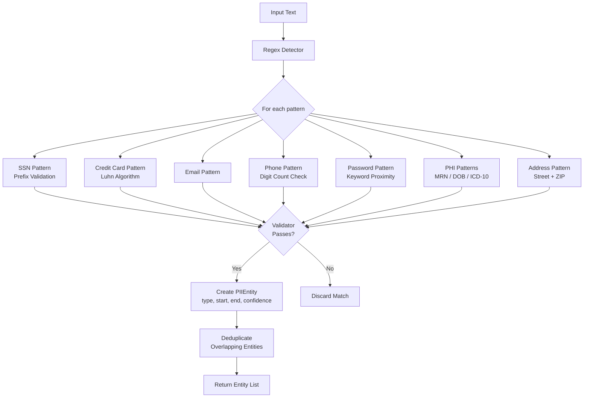
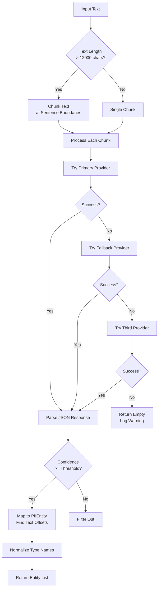
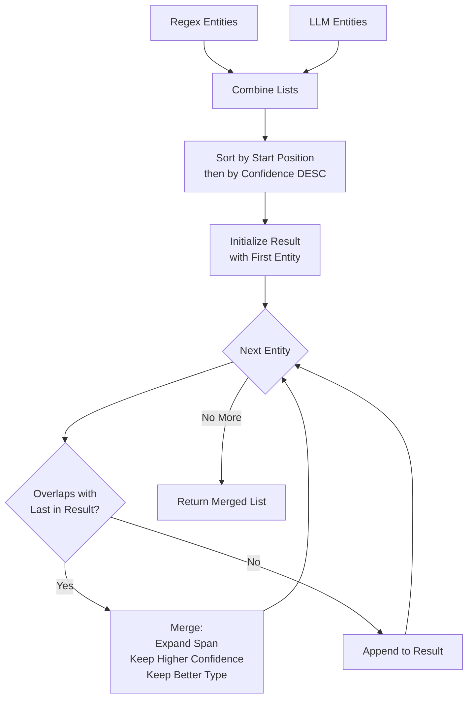
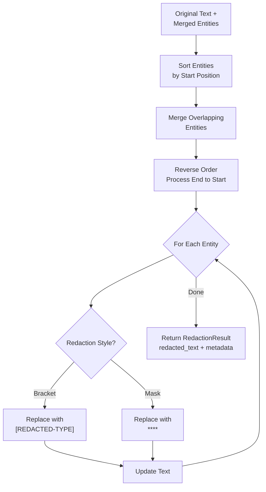
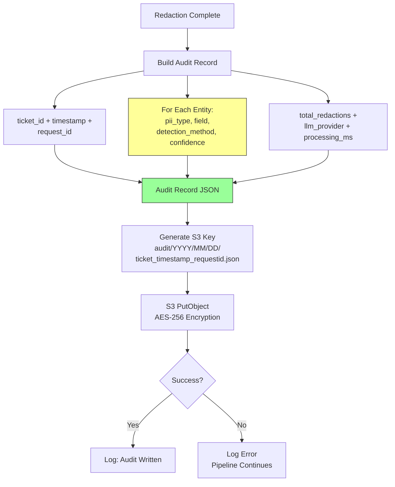
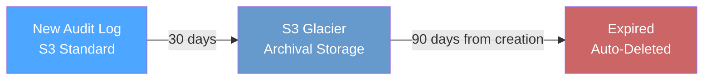

# PII Redaction Gateway — Detailed Flowcharts

## 1. Overall System Flow

## 2. Regex Detection Pipeline

## 3. LLM Detection Pipeline

## 4. Entity Merge Algorithm

## 5. Redaction Process

## 6. Audit Log Flow

## 7. S3 Audit Lifecycle

